---

theme : "night"
transition: "slide"

---

# GIT Workshops
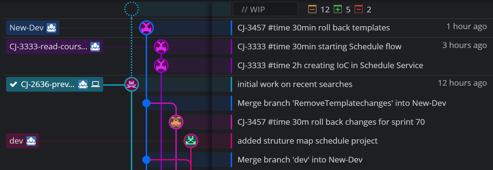

---

# Agenda


---

# Branching models

---

## Mainline
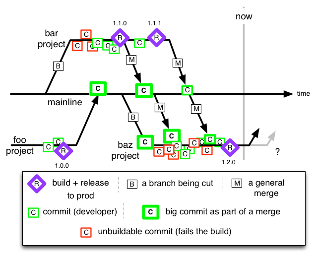

---

## Cascade
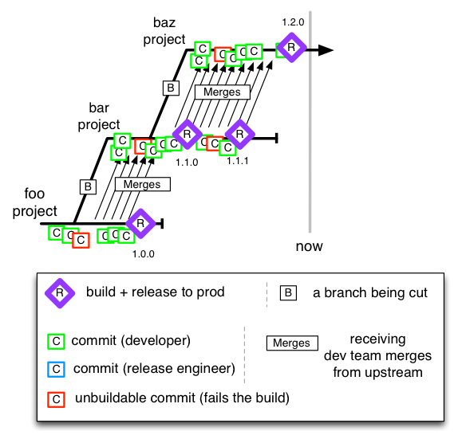

---

## Short lived feature branches
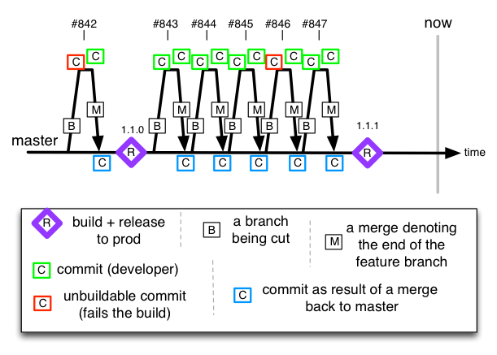

---

## Continuos delivery
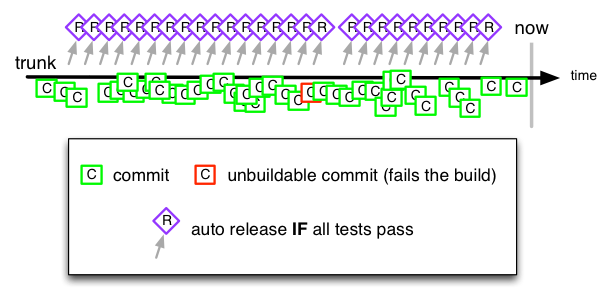

---

## gitflow
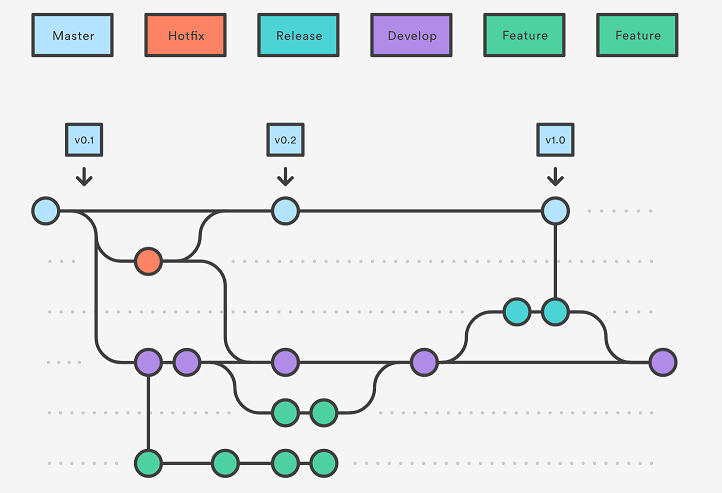

*successful git branching model*

---

# Common issues

---

## conflicts on dev branch

```
git push origin master
```

```
error: failed to push some refs to '/path/to/repo.git'
hint: Updates were rejected because the tip of your current branch is behind
hint: its remote counterpart. Merge the remote changes (e.g. 'git pull')
hint: before pushing again.
hint: See the 'Note about fast-forwards' in 'git push --help' for details.
```

---

## automatic merges 
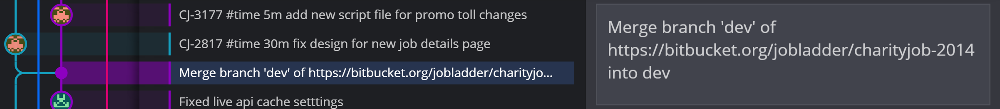

---

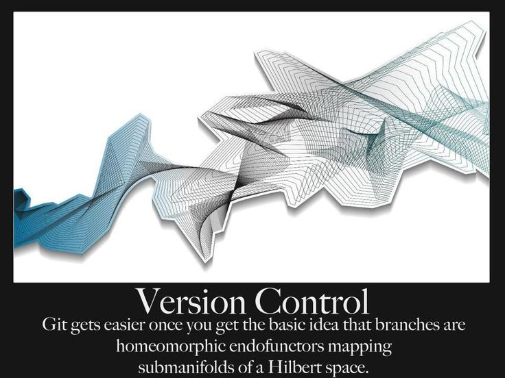

---

# Command line

---

## Three Rings for the Elven-kings under the sky,

```
git fetch
```

```
git pull
```

```
git checkout existing-branch
```

---

## Seven for the Dwarf-lords in their halls of stone,

```
git checkout -b new-branch
```

```
git add .
```

```
git commit
```

```
git checkout dev && git pull 
```

```
git checkout new-branch
```

```
git merge dev
```

```
git push
```
---


---

## One for the Dark Lord on his dark throne


```
git rebase -i HEAD~5
```

*In the Land of Mordor where the Shadows lie,*

*Squash last 5 commits in the current branch...*

---

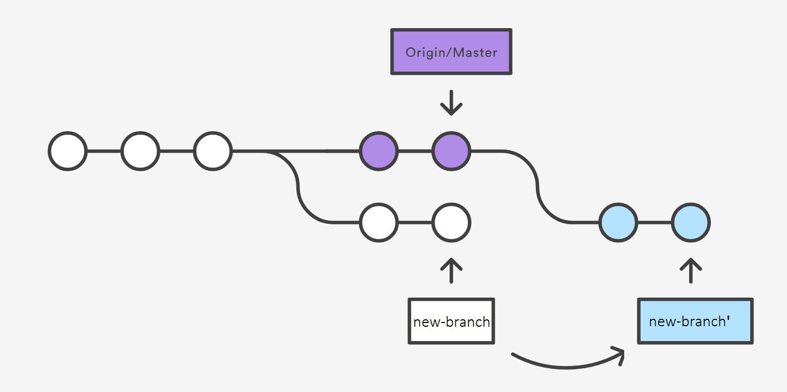

```
git pull --rebase origin master
```

---

# 🔨
## Practical example

*http://learngitbranching.js.org*

```
level intro1
level intro2
level intro3
level intro4
```

---

# ☕

Time for a break

---

# From DEV to PRODUCTION

*How deployments and release strategy depend on git workflow?*

---

# Deployments to DEV / QA / UAT / PROD

*Merging and minimizing conflicts matters...*

---

# Pull requests

---

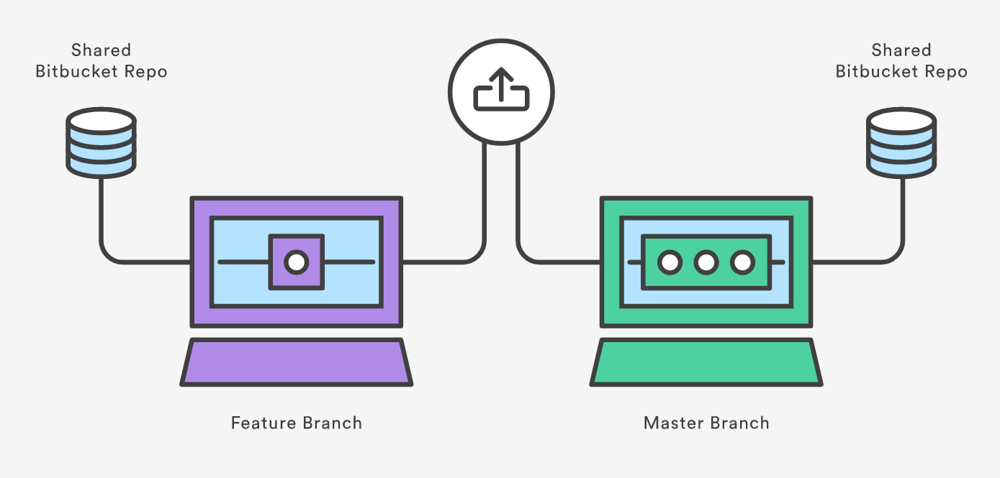

*feature branch pull requests*

---

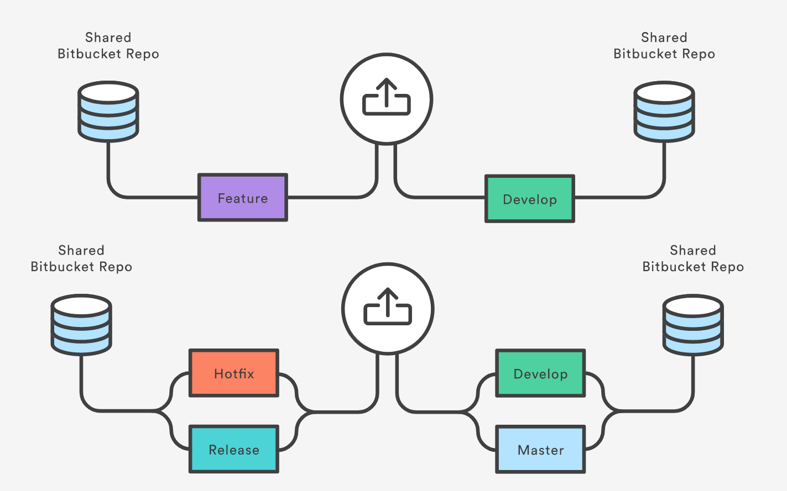

*pull requests in **gitflow** do work the same way*

---

# 🔨
## providing changes via pull requests

*Preparing code with **rebase** or **merge** from main branch*

*Creating a pull request*

*Review, fix, click on **Merge***

---

# 🔨
## Releasing to QA / UAT / PROD via Pull Requests

*Prepare a pull request*

*Automatically generate release notes*

*Review the changes*

*Merge and deploy*

---

# Git commit messages

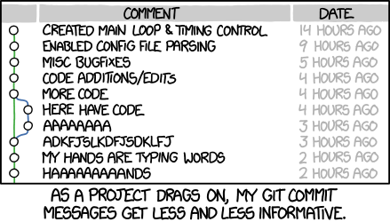

---

# Thanks for listening

*- Peter*

---